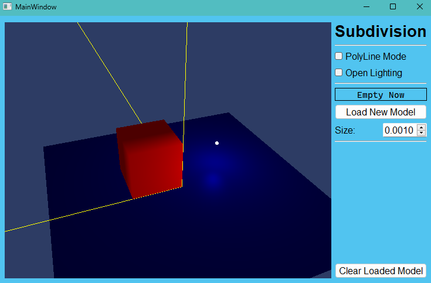
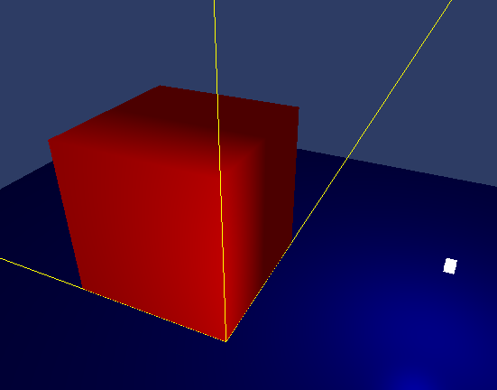
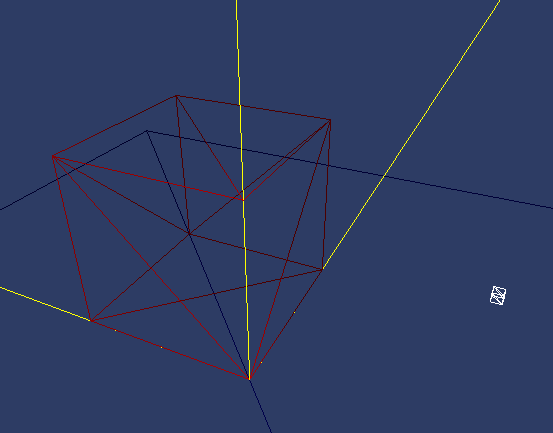
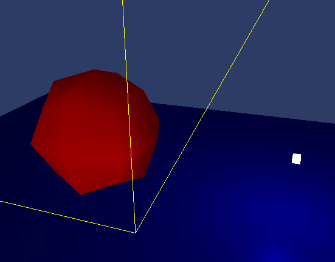
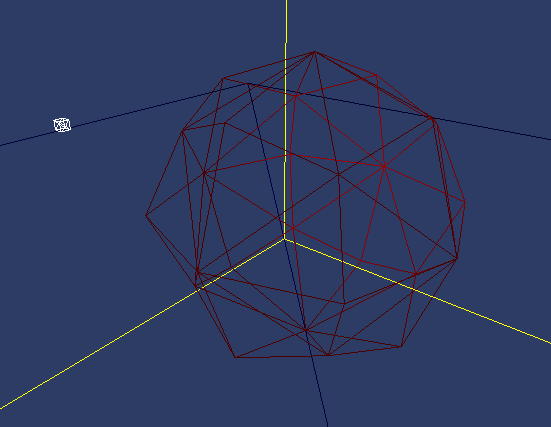
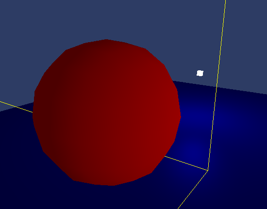
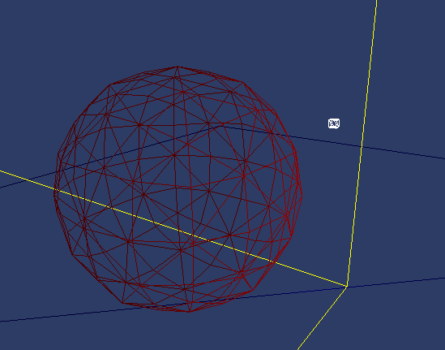

# Catmull-Clark Subdivision Project

## Overview

This project is for **Computer Graphics** class of University of Tokyo.

The project implements the Catmull-Clark subdivision algorithm. The primary function is to apply the algorithm on a cube, iterating the subdivision process several times to demonstrate the transformations. The program is implemented using OpenGL 4.3, Qt 5.15, and C++17 within the CLion IDE, and compiled with MinGW-32 provided by Qt5.15.

## Features

1. **Primary**: Implement the Catmull-Clark subdivision algorithm on a cube with multiple iterations.
2. **Additional**: The program supports .obj model loading, wireframe drawing, Blinn-Phong lighting model, lighting toggling, and a simple Qt OpenGL display interface.
   * **Camera Control**: Use the W, A, S, D keys to control the camera's horizontal and vertical movements. The camera's angle can be manipulated with the mouse, and the Q and E keys control upward and downward movements.

## Project Structure

The project has several key directories and files:

* **Sources**: The folder contains source files of the program.
  * **MeshSubdivision**: The folder contains the implementation of the subdivision algorithm.
    * `Mesh.c` and `Mesh.h`: Define the Mesh class, including the data structures for vertices, edges, and polygons.
    * `SubdivisionAdapter.c` and `.h`: Serve as the base class for all subdivision algorithms. Currently, only the Catmull-Clark algorithm is implemented, but it is designed for possible future additions and comparisons of other subdivision algorithms.
    * `CCSubdivision.c` and `.h`: Implement the Catmull-Clark subdivision algorithm.
* **Result**: The folder contains screenshots of the subdivided cube after each iteration.
* **Resources**: The folder contains shader files and .obj model files.

## Results

***【 NOTE: Because OpenGL3.1 and above versions do not support GL_QUAD, that is, quadrilateral fragment drawing, so here I convert the subdivided Mesh data into triangle fragment vertex data.】***

The following screenshots demonstrate the results of applying the Catmull-Clark subdivision algorithm to a cube.

* Basic UI surface:

  

1. **Original Cube**: The initial state of the cube. 

            

2. **Iteration 1**: The cube after the first iteration. 

   

3. **Iteration 2**: The cube after the second iteration. 

   

## Reference

* The Project github link:  [Fang2896/MeshSubdivision (github.com)](https://github.com/Fang2896/MeshSubdivision)

* OpenGL Tutorial: [Learn OpenGL, extensive tutorial resource for learning Modern OpenGL](https://learnopengl.com/)

* Qt References: [Qt 5.15](https://doc.qt.io/qt-5.15/)

* OpenGL of Qt Tutorial: [现代OpenGL学习教程_HELLO_IHAD的博客-CSDN博客](https://blog.csdn.net/z136411501/category_7565669.html?spm=1001.2014.3001.5482)

* Data Structures and Catmull-Clark subdivision algorithm references:

  [Catmull–Clark subdivision surface - Rosetta Code](https://rosettacode.org/wiki/Catmull–Clark_subdivision_surface#Python)

  [Catmull–Clark subdivision surface - Wikipedia](https://en.wikipedia.org/wiki/Catmull–Clark_subdivision_surface)

  [chobao/SubdivisionSurfaces: (Doo-Sabin, Catmull-Clark, and Loop) in a GUI (github.com)](https://github.com/chobao/SubdivisionSurfaces)

